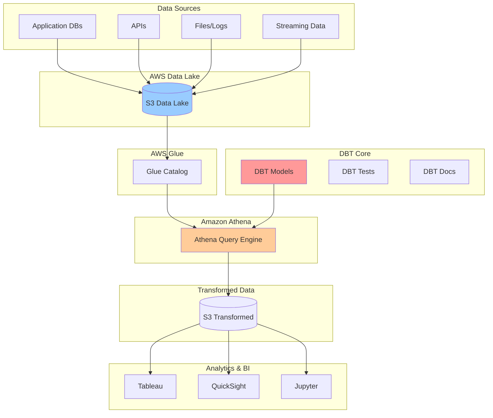

# DBT with Amazon Athena - Demo Implementation Guide

## Table of Contents
1. [DBT with Amazon Athena](#dbt-with-amazon-athena)
2. [Advanced Athena Integration](#advanced-athena-integration)
3. [Real-World Use Cases](#real-world-use-cases)
4. [Troubleshooting Common Issues](#troubleshooting-common-issues)
5. [Conclusion](#conclusion)

---

## DBT with Amazon Athena

### Why Athena + DBT?

Amazon Athena is a serverless query service that makes it easy to analyze data in S3 using standard SQL. Combined with DBT, it provides:

- **Cost-effective**: Pay only for queries you run
- **Serverless**: No infrastructure to manage
- **Scalable**: Handles petabyte-scale data
- **Integration**: Works seamlessly with AWS ecosystem

### DBT + Athena Architecture Overview



### Setting Up DBT with Athena

#### 1. Install the Athena Adapter

```bash
pip install dbt-athena-community
```

#### 2. Configure Your Profile

```yaml
# ~/.dbt/profiles.yml
my_athena_project:
  target: dev
  outputs:
    dev:
      type: athena
      s3_staging_dir: s3://my-dbt-athena-bucket/staging/
      s3_data_dir: s3://my-dbt-athena-bucket/data/
      region_name: us-east-1
      database: my_analytics_db
      schema: dbt_dev
      work_group: dbt_workgroup
      num_retries: 3
      aws_profile_name: default  # Optional: use specific AWS profile
    
    prod:
      type: athena
      s3_staging_dir: s3://my-dbt-athena-bucket/staging/
      s3_data_dir: s3://my-dbt-athena-bucket/data/
      region_name: us-east-1
      database: my_analytics_db
      schema: dbt_prod
      work_group: dbt_workgroup_prod
      num_retries: 3
```

#### 3. AWS Configuration

Ensure your AWS credentials are configured:

```bash
# Option 1: AWS CLI
aws configure

# Option 2: Environment variables
export AWS_ACCESS_KEY_ID=your_access_key
export AWS_SECRET_ACCESS_KEY=your_secret_key
export AWS_DEFAULT_REGION=us-east-1

# Option 3: IAM roles (recommended for EC2/ECS)
```

#### 4. Required IAM Permissions

```json
{
    "Version": "2012-10-17",
    "Statement": [
        {
            "Effect": "Allow",
            "Action": [
                "athena:*",
                "glue:GetDatabase",
                "glue:GetDatabases",
                "glue:GetTable",
                "glue:GetTables",
                "glue:GetPartition",
                "glue:GetPartitions",
                "glue:CreateTable",
                "glue:UpdateTable",
                "glue:DeleteTable"
            ],
            "Resource": "*"
        },
        {
            "Effect": "Allow",
            "Action": [
                "s3:GetBucketLocation",
                "s3:GetObject",
                "s3:ListBucket",
                "s3:ListBucketMultipartUploads",
                "s3:ListMultipartUploadParts",
                "s3:AbortMultipartUpload",
                "s3:PutObject",
                "s3:DeleteObject"
            ],
            "Resource": [
                "arn:aws:s3:::my-dbt-athena-bucket",
                "arn:aws:s3:::my-dbt-athena-bucket/*"
            ]
        }
    ]
}
```

### Athena-Specific Configurations

#### Table Formats

```sql
-- models/marts/sales_summary.sql
{{ config(
    materialized='table',
    table_type='hive',  -- or 'iceberg'
    format='parquet',
    write_compression='snappy',
    partitioned_by=['year', 'month'],
    bucketed_by=['customer_id'],
    bucket_count=10
) }}

SELECT
    customer_id,
    YEAR(order_date) as year,
    MONTH(order_date) as month,
    SUM(total_amount_dollars) as total_sales,
    COUNT(*) as order_count
FROM {{ ref('stg_orders') }}
GROUP BY customer_id, YEAR(order_date), MONTH(order_date)
```

#### External Tables

```sql
-- models/staging/stg_raw_logs.sql
{{ config(
    materialized='external',
    location='s3://my-data-lake/raw-logs/',
    file_format='json',
    table_properties={
        'projection.enabled': 'true',
        'projection.year.type': 'integer',
        'projection.year.range': '2020,2030',
        'projection.month.type': 'integer',
        'projection.month.range': '1,12',
        'projection.day.type': 'integer',
        'projection.day.range': '1,31'
    }
) }}

SELECT
    timestamp,
    user_id,
    event_type,
    properties
FROM external_table
WHERE year = {{ var('year') }}
  AND month = {{ var('month') }}
```

### Working with Partitions

#### Creating Partitioned Tables

```sql
-- models/marts/daily_events.sql
{{ config(
    materialized='table',
    partitioned_by=['event_date'],
    format='parquet'
) }}

SELECT
    event_id,
    user_id,
    event_type,
    DATE(timestamp) as event_date,
    timestamp,
    properties
FROM {{ ref('stg_events') }}
WHERE DATE(timestamp) >= '2023-01-01'
```

#### Partition Pruning

```sql
-- Efficient query with partition pruning
SELECT *
FROM {{ ref('daily_events') }}
WHERE event_date BETWEEN '2023-10-01' AND '2023-10-31'
  AND event_type = 'purchase'
```

---

## Advanced Athena Integration

### Iceberg Tables

Apache Iceberg provides advanced table format features:

**Use Case:** Enable ACID transactions, time travel queries, and schema evolution for your data lake tables. Perfect for scenarios where you need to track historical changes, perform rollbacks, or handle concurrent writes to the same dataset.

```sql
-- models/marts/customer_events_iceberg.sql
{{ config(
    materialized='table',
    table_type='iceberg',
    format='parquet',
    partitioned_by=['event_month'],
    table_properties={
        'optimize_rewrite_delete_file_threshold': '10',
        'write.target-file-size-bytes': '134217728'
    }
) }}

SELECT
    event_id,
    customer_id,
    event_type,
    event_timestamp,
    DATE_FORMAT(event_timestamp, '%Y-%m') as event_month,
    event_properties
FROM {{ ref('stg_customer_events') }}
```

### Time Travel with Iceberg

**Use Case:** Query historical versions of your data for auditing, debugging, or analyzing how data has changed over time. Essential for compliance requirements or understanding the impact of data corrections.

```sql
-- Query historical data
SELECT *
FROM {{ ref('customer_events_iceberg') }}
FOR SYSTEM_TIME AS OF TIMESTAMP '2023-10-01 00:00:00'
WHERE customer_id = 12345
```

### Incremental Models with Athena

**Use Case:** Process only new or changed data to reduce query costs and improve performance. Critical for large datasets where full refreshes would be expensive and time-consuming.

```sql
-- models/marts/incremental_sales.sql
{{ config(
    materialized='incremental',
    unique_key='sale_id',
    incremental_strategy='merge',
    on_schema_change='sync_all_columns',
    partitioned_by=['sale_date']
) }}

SELECT
    sale_id,
    customer_id,
    product_id,
    sale_amount,
    DATE(sale_timestamp) as sale_date,
    sale_timestamp
FROM {{ ref('stg_sales') }}


    WHERE sale_timestamp > (
        SELECT MAX(sale_timestamp) 
        FROM {{ this }}
    )

```

### Custom Macros for Athena

**Use Case:** Create reusable SQL patterns specific to Athena and AWS services. Useful for standardizing table creation, optimization operations, and complex data type handling across your project.

```sql
-- macros/athena_utils.sql

    CREATE EXTERNAL TABLE IF NOT EXISTS {{ table_name }} (
        
            {{ column.name }} {{ column.type }},
        
    )
    STORED AS {{ file_format }}
    LOCATION '{{ location }}'



    OPTIMIZE {{ table_name }} REWRITE DATA USING BIN_PACK

```

### Working with Complex Data Types

**Use Case:** Handle JSON, arrays, and nested data structures commonly found in modern applications, IoT devices, and API responses. Essential for processing semi-structured data from web applications, mobile apps, and third-party services.

```sql
-- models/staging/stg_json_events.sql
SELECT
    event_id,
    json_extract_scalar(event_data, '$.user_id') as user_id,
    json_extract_scalar(event_data, '$.event_type') as event_type,
    json_extract(event_data, '$.properties') as properties,
    
    -- Working with arrays
    CAST(json_extract(event_data, '$.tags') AS ARRAY<VARCHAR>) as tags,
    
    -- Working with maps
    CAST(json_extract(event_data, '$.metadata') AS MAP<VARCHAR, VARCHAR>) as metadata,
    
    event_timestamp
FROM {{ source('raw_data', 'json_events') }}
```

---

## Real-World Use Cases

### Use Case 1: E-commerce Analytics

#### Project Structure
```
ecommerce_analytics/
├── models/
│   ├── staging/
│   │   ├── stg_customers.sql
│   │   ├── stg_orders.sql
│   │   ├── stg_products.sql
│   │   └── stg_order_items.sql
│   ├── intermediate/
│   │   ├── int_customer_metrics.sql
│   │   ├── int_product_metrics.sql
│   │   └── int_cohort_analysis.sql
│   └── marts/
│       ├── dim_customers.sql
│       ├── dim_products.sql
│       ├── fct_orders.sql
│       └── fct_customer_cohorts.sql
```

#### Customer Cohort Analysis

**Use Case:** Analyze customer retention and lifetime value by grouping customers based on their first purchase month. Critical for understanding customer behavior patterns, measuring the effectiveness of retention strategies, and predicting future revenue.

```sql
-- models/marts/fct_customer_cohorts.sql
{{ config(materialized='table') }}

WITH customer_orders AS (
    SELECT
        customer_id,
        DATE_TRUNC('month', MIN(order_date)) as cohort_month,
        DATE_TRUNC('month', order_date) as order_month,
        COUNT(*) as orders,
        SUM(total_amount) as revenue
    FROM {{ ref('stg_orders') }}
    WHERE status = 'completed'
    GROUP BY customer_id, DATE_TRUNC('month', order_date)
),

cohort_data AS (
    SELECT
        cohort_month,
        order_month,
        COUNT(DISTINCT customer_id) as customers,
        SUM(orders) as total_orders,
        SUM(revenue) as total_revenue,
        -- Calculate period number (0 for acquisition month, 1 for month 1, etc.)
        DATE_DIFF('month', cohort_month, order_month) as period_number
    FROM customer_orders
    GROUP BY cohort_month, order_month
),

cohort_sizes AS (
    SELECT
        cohort_month,
        COUNT(DISTINCT customer_id) as cohort_size
    FROM customer_orders
    GROUP BY cohort_month
)

SELECT
    cd.cohort_month,
    cd.order_month,
    cd.period_number,
    cd.customers,
    cs.cohort_size,
    cd.customers * 100.0 / cs.cohort_size as retention_rate,
    cd.total_revenue / cd.customers as revenue_per_customer
FROM cohort_data cd
JOIN cohort_sizes cs ON cd.cohort_month = cs.cohort_month
ORDER BY cd.cohort_month, cd.period_number
```

### Use Case 2: Marketing Attribution

**Use Case:** Track customer touchpoints across multiple marketing channels and attribute conversions using various attribution models. Essential for optimizing marketing spend, understanding customer journey, and measuring campaign effectiveness.

```sql
-- models/marts/marketing_attribution.sql
{{ config(
    materialized='incremental',
    unique_key=['customer_id', 'conversion_date'],
    partitioned_by=['conversion_date']
) }}

WITH customer_touchpoints AS (
    SELECT
        customer_id,
        touchpoint_date,
        channel,
        campaign,
        cost,
        ROW_NUMBER() OVER (
            PARTITION BY customer_id 
            ORDER BY touchpoint_date
        ) as touchpoint_sequence,
        -- First touch
        FIRST_VALUE(channel) OVER (
            PARTITION BY customer_id 
            ORDER BY touchpoint_date 
            ROWS UNBOUNDED PRECEDING
        ) as first_touch_channel,
        -- Last touch
        LAST_VALUE(channel) OVER (
            PARTITION BY customer_id 
            ORDER BY touchpoint_date 
            ROWS BETWEEN UNBOUNDED PRECEDING AND UNBOUNDED FOLLOWING
        ) as last_touch_channel
    FROM {{ ref('stg_marketing_touchpoints') }}
),

conversions AS (
    SELECT
        customer_id,
        conversion_date,
        conversion_value,
        conversion_type
    FROM {{ ref('stg_conversions') }}
    
    
        WHERE conversion_date > (SELECT MAX(conversion_date) FROM {{ this }})
    
)

SELECT
    c.customer_id,
    c.conversion_date,
    c.conversion_value,
    c.conversion_type,
    
    -- Attribution models
    t.first_touch_channel,
    t.last_touch_channel,
    
    -- Linear attribution (equal weight to all touchpoints)
    c.conversion_value / COUNT(t.touchpoint_date) OVER (PARTITION BY c.customer_id) as linear_attribution_value,
    
    -- Time decay attribution (more recent touchpoints get more credit)
    c.conversion_value * EXP(-0.1 * (c.conversion_date - t.touchpoint_date)) / 
        SUM(EXP(-0.1 * (c.conversion_date - t.touchpoint_date))) OVER (PARTITION BY c.customer_id) as time_decay_attribution_value

FROM conversions c
LEFT JOIN customer_touchpoints t 
    ON c.customer_id = t.customer_id 
    AND t.touchpoint_date <= c.conversion_date
```

### Use Case 3: IoT Data Processing

**Use Case:** Process and analyze sensor data from IoT devices, including data quality validation, anomaly detection, and time-series analysis. Critical for monitoring equipment health, predicting maintenance needs, and optimizing operational efficiency.

```sql
-- models/staging/stg_iot_sensors.sql
{{ config(
    materialized='incremental',
    unique_key=['device_id', 'timestamp'],
    partitioned_by=['date_partition'],
    format='parquet'
) }}

SELECT
    device_id,
    sensor_type,
    timestamp,
    DATE(timestamp) as date_partition,
    temperature,
    humidity,
    pressure,
    battery_level,
    
    -- Data quality flags
    CASE 
        WHEN temperature < -50 OR temperature > 100 THEN 'INVALID_TEMP'
        WHEN humidity < 0 OR humidity > 100 THEN 'INVALID_HUMIDITY'
        WHEN battery_level < 0 OR battery_level > 100 THEN 'INVALID_BATTERY'
        ELSE 'VALID'
    END as data_quality_flag,
    
    -- Calculate moving averages
    AVG(temperature) OVER (
        PARTITION BY device_id 
        ORDER BY timestamp 
        ROWS BETWEEN 5 PRECEDING AND CURRENT ROW
    ) as temp_moving_avg_6_readings

FROM {{ source('iot_raw', 'sensor_readings') }}
WHERE device_id IS NOT NULL


    AND timestamp > (SELECT MAX(timestamp) FROM {{ this }})

```

---

## Troubleshooting Common Issues

### 1. Athena Connection Issues

#### Problem: "Unable to connect to Athena"
```bash
# Check your AWS credentials
aws sts get-caller-identity

# Verify your profile configuration
dbt debug --profiles-dir ~/.dbt
```

#### Solution:
- Ensure AWS credentials are properly configured
- Verify IAM permissions include Athena and S3 access
- Check that the S3 staging directory exists and is accessible

### 2. Performance Issues

#### Problem: Slow query execution
```sql
-- Inefficient query
SELECT *
FROM {{ ref('large_table') }}
WHERE some_column = 'value'
```

#### Solution:
```sql
-- Optimized query with partition pruning
SELECT 
    specific_column1,
    specific_column2
FROM {{ ref('large_table') }}
WHERE partition_column = '2023-10-01'  -- Use partition column
  AND some_column = 'value'
```

### 3. Memory and Resource Limits

#### Problem: "Query exceeded memory limit"
```yaml
# Increase workgroup settings
work_group: high_memory_workgroup
```

#### Solution:
- Use appropriate workgroups with higher resource limits
- Optimize queries to process less data
- Consider breaking large transformations into smaller steps

### 4. Data Type Issues

#### Problem: "Cannot cast varchar to integer"
```sql
-- Problematic code
SELECT CAST(maybe_numeric_column AS INTEGER)
FROM {{ ref('source_table') }}
```

#### Solution:
```sql
-- Safe casting with validation
SELECT 
    CASE 
        WHEN REGEXP_LIKE(maybe_numeric_column, '^[0-9]+$') 
        THEN CAST(maybe_numeric_column AS INTEGER)
        ELSE NULL 
    END as numeric_column
FROM {{ ref('source_table') }}
```

### 5. Incremental Model Issues

#### Problem: Incremental models not updating correctly
```sql
-- Check for proper unique key configuration
{{ config(
    materialized='incremental',
    unique_key='id',  -- Ensure this is actually unique
    on_schema_change='sync_all_columns'
) }}
```

#### Solution:
- Verify unique key is truly unique
- Use composite keys when necessary: `unique_key=['col1', 'col2']`
- Test incremental logic with `--full-refresh` flag

### 6. Partition Management

#### Problem: Too many small partitions
```sql
-- Avoid over-partitioning
{{ config(
    partitioned_by=['year', 'month', 'day', 'hour']  -- Too granular
) }}
```

#### Solution:
```sql
-- Better partitioning strategy
{{ config(
    partitioned_by=['year', 'month']  -- More appropriate granularity
) }}
```

### 7. S3 Path and Permissions Issues

#### Problem: "Access Denied" errors when writing to S3
```bash
# Check S3 bucket permissions
aws s3 ls s3://your-bucket-name/

# Test write permissions
aws s3 cp test.txt s3://your-bucket-name/test/
```

#### Solution:
- Verify S3 bucket policy allows DBT operations
- Ensure IAM role/user has proper S3 permissions
- Check bucket exists and path is correct in profiles.yml

### 8. Glue Catalog Issues

#### Problem: Tables not appearing in Athena after DBT run
```sql
-- Check if table exists in Glue Catalog
SHOW TABLES IN your_database;
```

#### Solution:
- Verify Glue permissions in IAM policy
- Check database name matches between profiles.yml and Glue
- Ensure table creation succeeded without errors

---

## Conclusion

This implementation guide has covered the practical aspects of using DBT with Amazon Athena, from basic setup to advanced use cases. Here are the key takeaways:

### Key Benefits of DBT + Athena

1. **Cost-Effective Analytics**: Pay only for the queries you run
2. **Scalable Architecture**: Handle petabyte-scale data without infrastructure management
3. **Modern Data Engineering**: Apply software engineering best practices to analytics
4. **Collaborative Development**: Version control, testing, and documentation built-in

### Implementation Best Practices Summary

1. **Start Simple**: Begin with basic staging and mart models
2. **Optimize for Athena**: Use appropriate partitioning and file formats
3. **Test Everything**: Implement comprehensive data quality tests
4. **Monitor Performance**: Track query costs and execution times
5. **Document Thoroughly**: Maintain clear documentation for all models

### Next Steps for Implementation

1. **Set up your DBT project** with Athena adapter
2. **Configure AWS resources** (S3 buckets, IAM permissions, Glue Catalog)
3. **Implement the staging → intermediate → marts pattern**
4. **Add Athena-specific optimizations** (partitioning, file formats)
5. **Deploy monitoring and alerting** for production use

### Resources for Further Learning

- [DBT Documentation](https://docs.getdbt.com/)
- [DBT Athena Adapter Documentation](https://github.com/dbt-athena/dbt-athena)
- [Amazon Athena User Guide](https://docs.aws.amazon.com/athena/)
- [AWS Glue Catalog Documentation](https://docs.aws.amazon.com/glue/)
- [Apache Iceberg Documentation](https://iceberg.apache.org/)

### Final Implementation Notes

DBT with Amazon Athena provides a powerful, cost-effective solution for modern data transformation and analytics. The serverless nature of Athena combined with DBT's software engineering practices creates an ideal environment for scalable data pipelines.

Key considerations for successful implementation:
- **Cost Management**: Use partitioning and query optimization to control costs
- **Performance**: Leverage columnar formats and appropriate compression
- **Reliability**: Implement comprehensive testing and monitoring
- **Scalability**: Design for growth with proper data modeling patterns

Remember that data engineering is an iterative process. Start with the basics, measure your results, and continuously improve your implementation based on real-world usage and feedback from your stakeholders.

---

*This implementation guide represents current best practices as of 2024. Always refer to the official documentation for the most up-to-date information and features.*
