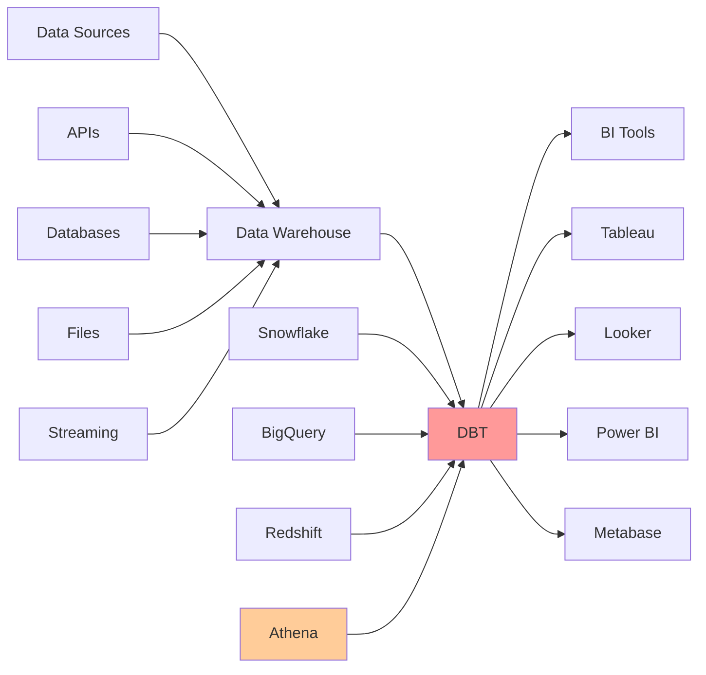
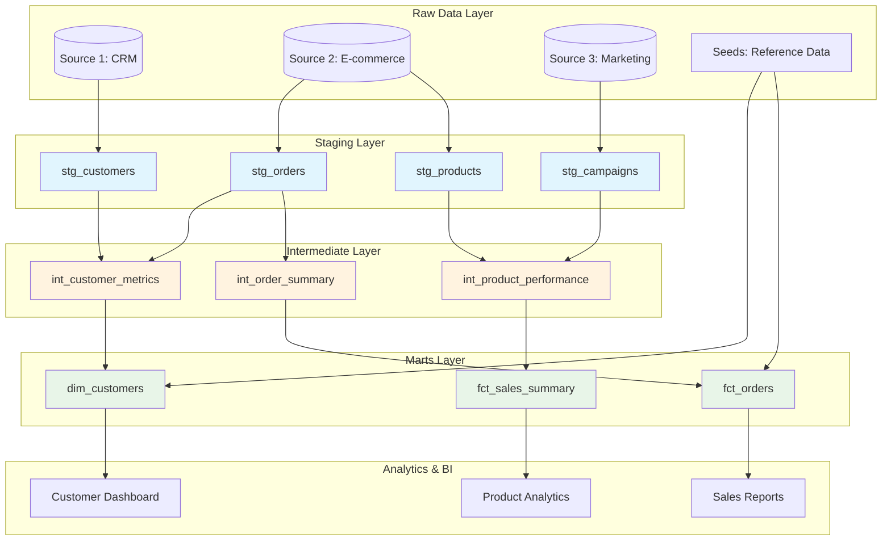

# The Complete DBT (Data Build Tool) Tutorial Guide

## Table of Contents
1. [Introduction to DBT](#introduction-to-dbt)
2. [DBT Core Concepts](#dbt-core-concepts)
3. [Setting Up DBT](#setting-up-dbt)
4. [DBT Project Structure](#dbt-project-structure)
5. [Building Your First Models](#building-your-first-models)
6. [Advanced DBT Features](#advanced-dbt-features)
7. [Testing and Documentation](#testing-and-documentation)
8. [Best Practices and Optimization](#best-practices-and-optimization)
9. [Advanced Patterns and Techniques](#advanced-patterns-and-techniques)
10. [Deployment and CI/CD](#deployment-and-cicd)
11. [Monitoring and Observability](#monitoring-and-observability)
12. [Troubleshooting Common Issues](#troubleshooting-common-issues)

---

## Introduction to DBT

### What is DBT?

DBT (Data Build Tool) is a command-line tool that enables data analysts and engineers to transform data in their warehouse more effectively. It allows you to write modular SQL queries, test your data, and document your work - all while following software engineering best practices.

### Why DBT Matters

In the modern data stack, raw data often needs significant transformation before it's ready for analysis. Traditional ETL tools can be complex and require specialized knowledge. DBT democratizes data transformation by:

- **Using SQL**: Leverages the language most data professionals already know
- **Version Control**: Treats analytics code like software with Git integration
- **Testing**: Ensures data quality through automated tests
- **Documentation**: Auto-generates documentation from your code
- **Modularity**: Promotes reusable, maintainable code

### The Modern Data Stack

DBT fits perfectly into the modern data stack:



**Traditional vs Modern Data Stack:**
```
Traditional ETL:
Extract → Transform → Load
(Complex, rigid, requires specialized tools)

Modern ELT with DBT:
Extract → Load → Transform
(Simple, flexible, uses SQL and version control)
```

---

## DBT Core Concepts

### 1. Models

Models are the building blocks of DBT. Each model is a SQL SELECT statement that transforms raw data into a more useful format.

**Use Case:** Transform raw customer data from your application database into a clean, standardized format for analytics. For example, standardizing name formats, filtering out invalid records, and preparing data for downstream business logic.

```sql
-- models/staging/stg_customers.sql
SELECT
    customer_id,
    UPPER(first_name) as first_name,
    UPPER(last_name) as last_name,
    email,
    created_at
FROM {{ source('raw_data', 'customers') }}
WHERE customer_id IS NOT NULL
```

### 2. Sources

Sources represent the raw data tables in your warehouse. They're defined in YAML files and referenced in models.

**Use Case:** Document and test your raw data sources to ensure data quality at the entry point. This is essential when you have data coming from multiple systems (CRM, e-commerce platform, marketing tools) and need to validate data integrity before transformation.

```yaml
# models/staging/sources.yml
version: 2

sources:
  - name: raw_data
    description: Raw data from our application database
    tables:
      - name: customers
        description: Customer information
        columns:
          - name: customer_id
            description: Unique identifier for customers
            tests:
              - unique
              - not_null
```

### 3. Seeds

Seeds are CSV files that contain static data you want to load into your warehouse.

**Use Case:** Load reference data that doesn't change frequently, such as country codes, product categories, or mapping tables. Perfect for small lookup tables that your analytics team maintains manually and needs to join with transactional data.

```csv
# seeds/country_codes.csv
country_code,country_name
US,United States
CA,Canada
UK,United Kingdom
```

### 4. Snapshots

Snapshots capture the state of mutable tables over time, implementing Type 2 Slowly Changing Dimensions.

**Use Case:** Track historical changes in customer profiles, product prices, or subscription statuses. Essential for analyzing how customer segments evolved over time or understanding the impact of pricing changes on revenue.

```sql
-- snapshots/customers_snapshot.sql

    {{
        config(
          target_schema='snapshots',
          unique_key='customer_id',
          strategy='timestamp',
          updated_at='updated_at',
        )
    }}
    SELECT * FROM {{ source('raw_data', 'customers') }}

```

### 5. Tests

Tests validate your data and assumptions. DBT includes built-in tests and supports custom tests.

**Use Case:** Ensure data quality by automatically validating business rules and assumptions. Critical for catching data issues early, such as duplicate customer IDs, missing required fields, or invalid data ranges before they impact downstream analytics.

```yaml
# Built-in tests
models:
  - name: stg_customers
    columns:
      - name: customer_id
        tests:
          - unique
          - not_null
      - name: email
        tests:
          - unique
```

### 6. Macros

Macros are reusable pieces of Jinja code that generate SQL.

```sql
-- macros/cents_to_dollars.sql

    ROUND({{ column_name }} / 100.0, {{ precision }})

```

---

## Setting Up DBT

### Installation Options

#### 1. DBT Core (Open Source)
```bash
# Install via pip
pip install dbt-core

# Install with specific adapter (e.g., Athena)
pip install dbt-athena-community
```

#### 2. DBT Cloud (Managed Service)
- Web-based IDE
- Scheduled runs
- Built-in version control
- Collaboration features

### Initial Setup

1. **Initialize a new project:**
```bash
dbt init my_dbt_project
cd my_dbt_project
```

2. **Configure your profile:**
```yaml
# ~/.dbt/profiles.yml
my_dbt_project:
  target: dev
  outputs:
    dev:
      type: athena
      s3_staging_dir: s3://my-athena-bucket/dbt-staging/
      region_name: us-east-1
      database: my_database
      schema: dbt_dev
      work_group: primary
```

3. **Test your connection:**
```bash
dbt debug
```

---

## DBT Project Structure

### Standard Project Layout

```
my_dbt_project/
├── dbt_project.yml          # Project configuration
├── profiles.yml             # Connection profiles (optional)
├── models/                  # SQL models
│   ├── staging/            # Raw data transformations
│   ├── intermediate/       # Business logic transformations
│   └── marts/             # Final business-ready tables
├── macros/                 # Reusable SQL code
├── seeds/                  # Static data files
├── snapshots/             # Historical data captures
├── tests/                 # Custom data tests
├── analysis/              # Ad-hoc analysis queries
└── docs/                  # Additional documentation
```

### DBT Data Flow Architecture



### Project Configuration

```yaml
# dbt_project.yml
name: 'my_dbt_project'
version: '1.0.0'
config-version: 2

profile: 'my_dbt_project'

model-paths: ["models"]
analysis-paths: ["analysis"]
test-paths: ["tests"]
seed-paths: ["seeds"]
macro-paths: ["macros"]
snapshot-paths: ["snapshots"]

target-path: "target"
clean-targets:
  - "target"
  - "dbt_packages"

models:
  my_dbt_project:
    staging:
      +materialized: view
    intermediate:
      +materialized: view
    marts:
      +materialized: table
```

---

## Building Your First Models

### Staging Models

Staging models clean and standardize raw data:

```sql
-- models/staging/stg_orders.sql
{{ config(materialized='view') }}

SELECT
    order_id,
    customer_id,
    order_date,
    status,
    -- Standardize status values
    CASE 
        WHEN status IN ('completed', 'complete') THEN 'completed'
        WHEN status IN ('cancelled', 'canceled') THEN 'cancelled'
        ELSE status
    END as standardized_status,
    total_amount_cents,
    {{ cents_to_dollars('total_amount_cents') }} as total_amount_dollars,
    created_at,
    updated_at
FROM {{ source('ecommerce', 'orders') }}
WHERE order_id IS NOT NULL
```

### Intermediate Models

Intermediate models contain business logic:

```sql
-- models/intermediate/int_customer_order_summary.sql
{{ config(materialized='view') }}

SELECT
    customer_id,
    COUNT(*) as total_orders,
    SUM(total_amount_dollars) as total_spent,
    AVG(total_amount_dollars) as avg_order_value,
    MIN(order_date) as first_order_date,
    MAX(order_date) as last_order_date,
    COUNT(CASE WHEN standardized_status = 'completed' THEN 1 END) as completed_orders,
    COUNT(CASE WHEN standardized_status = 'cancelled' THEN 1 END) as cancelled_orders
FROM {{ ref('stg_orders') }}
GROUP BY customer_id
```

### Mart Models

Mart models are business-ready tables:

```sql
-- models/marts/dim_customers.sql
{{ config(materialized='table') }}

SELECT
    c.customer_id,
    c.first_name,
    c.last_name,
    c.email,
    c.created_at as customer_since,
    
    -- Order summary metrics
    COALESCE(o.total_orders, 0) as total_orders,
    COALESCE(o.total_spent, 0) as total_spent,
    COALESCE(o.avg_order_value, 0) as avg_order_value,
    o.first_order_date,
    o.last_order_date,
    
    -- Customer segmentation
    CASE 
        WHEN o.total_spent >= 1000 THEN 'High Value'
        WHEN o.total_spent >= 500 THEN 'Medium Value'
        WHEN o.total_spent > 0 THEN 'Low Value'
        ELSE 'No Purchases'
    END as customer_segment,
    
    -- Recency calculation
    CASE 
        WHEN o.last_order_date >= CURRENT_DATE - INTERVAL '30' DAY THEN 'Active'
        WHEN o.last_order_date >= CURRENT_DATE - INTERVAL '90' DAY THEN 'At Risk'
        WHEN o.last_order_date IS NOT NULL THEN 'Inactive'
        ELSE 'Never Purchased'
    END as customer_status

FROM {{ ref('stg_customers') }} c
LEFT JOIN {{ ref('int_customer_order_summary') }} o
    ON c.customer_id = o.customer_id
```

---

## Advanced DBT Features

### Incremental Models

Incremental models only process new or changed data:

```sql
-- models/marts/fct_daily_sales.sql
{{ config(
    materialized='incremental',
    unique_key='date_day',
    on_schema_change='fail'
) }}

SELECT
    DATE(order_date) as date_day,
    COUNT(*) as total_orders,
    SUM(total_amount_dollars) as total_revenue,
    COUNT(DISTINCT customer_id) as unique_customers
FROM {{ ref('stg_orders') }}
WHERE standardized_status = 'completed'


    -- Only process new data
    AND order_date >= (SELECT MAX(date_day) FROM {{ this }})


GROUP BY DATE(order_date)
```

### Hooks

Hooks run SQL before or after model execution:

```yaml
# dbt_project.yml
models:
  my_dbt_project:
    marts:
      +pre-hook: "INSERT INTO audit_log VALUES ('{{ this }}', '{{ run_started_at }}', 'started')"
      +post-hook: "INSERT INTO audit_log VALUES ('{{ this }}', '{{ run_started_at }}', 'completed')"
```

### Variables

Variables make your project configurable:

```yaml
# dbt_project.yml
vars:
  start_date: '2023-01-01'
  end_date: '2023-12-31'
```

```sql
-- Use in models
WHERE order_date BETWEEN '{{ var("start_date") }}' AND '{{ var("end_date") }}'
```

### Exposures

Exposures document how your models are used downstream:

```yaml
# models/marts/exposures.yml
version: 2

exposures:
  - name: customer_dashboard
    type: dashboard
    maturity: high
    url: https://bi.company.com/dashboards/customers
    description: Executive dashboard showing customer metrics
    depends_on:
      - ref('dim_customers')
      - ref('fct_daily_sales')
    owner:
      name: Analytics Team
      email: analytics@company.com
```

---

## Testing and Documentation

### Built-in Tests

```yaml
# models/staging/schema.yml
version: 2

models:
  - name: stg_customers
    description: Cleaned customer data
    columns:
      - name: customer_id
        description: Unique customer identifier
        tests:
          - unique
          - not_null
      - name: email
        description: Customer email address
        tests:
          - unique
          - not_null
```

### Custom Tests

```sql
-- tests/assert_positive_order_amounts.sql
SELECT *
FROM {{ ref('stg_orders') }}
WHERE total_amount_dollars <= 0
```

### Generic Tests

```sql
-- macros/test_not_empty_string.sql

    SELECT *
    FROM {{ model }}
    WHERE {{ column_name }} = '' OR {{ column_name }} IS NULL

```

### Documentation

```yaml
# models/schema.yml
version: 2

models:
  - name: dim_customers
    description: |
      Customer dimension table containing customer attributes and calculated metrics.
      
      This table is updated daily and includes:
      - Basic customer information
      - Order summary statistics
      - Customer segmentation
      - Recency status
    columns:
      - name: customer_id
        description: "{{ doc('customer_id') }}"
      - name: customer_segment
        description: |
          Customer value segmentation based on total spend:
          - High Value: $1000+
          - Medium Value: $500-$999
          - Low Value: $1-$499
          - No Purchases: $0
```

```markdown
<!-- docs/customer_id.md -->

Unique identifier for each customer. This ID is generated by our application
and remains constant throughout the customer lifecycle.

```

---

## Best Practices and Optimization

### Performance Optimization

#### 1. Partition Strategy

```sql
-- Good: Partition by commonly filtered columns
{{ config(
    partitioned_by=['year', 'month'],
    format='parquet'
) }}

-- Avoid: Too many partitions
{{ config(
    partitioned_by=['year', 'month', 'day', 'hour']  -- Too granular
) }}
```

#### 2. File Format Selection

```yaml
# dbt_project.yml
models:
  my_project:
    staging:
      +format: parquet
      +write_compression: snappy
    marts:
      +format: parquet
      +write_compression: gzip
```

#### 3. Query Optimization

```sql
-- Use column pruning
SELECT 
    customer_id,
    order_date,
    total_amount
FROM {{ ref('large_orders_table') }}
-- Instead of SELECT *

-- Use partition pruning
WHERE order_date >= '2023-01-01'
  AND order_date < '2024-01-01'

-- Use appropriate joins
INNER JOIN {{ ref('customers') }} c
    ON o.customer_id = c.customer_id
-- Instead of unnecessary LEFT JOINs
```

### Cost Optimization

#### 1. Workgroup Configuration

```yaml
# Use workgroups to control costs
work_group: cost_control_workgroup
```

#### 2. Query Result Caching

```sql
-- Enable result caching in workgroup settings
-- Reuse results for identical queries
```

#### 3. Columnar Storage

```sql
{{ config(
    format='parquet',  -- More efficient than JSON/CSV
    write_compression='snappy'
) }}
```

### Data Quality Best Practices

#### 1. Comprehensive Testing

```yaml
# models/schema.yml
version: 2

models:
  - name: dim_customers
    tests:
      - dbt_utils.unique_combination_of_columns:
          combination_of_columns:
            - customer_id
            - effective_date
    columns:
      - name: customer_id
        tests:
          - unique
          - not_null
      - name: email
        tests:
          - unique
          - not_null
          - dbt_utils.accepted_values:
              values: ['@gmail.com', '@yahoo.com', '@company.com']
              quote: false
```

#### 2. Data Freshness

```yaml
# models/sources.yml
sources:
  - name: raw_data
    tables:
      - name: orders
        freshness:
          warn_after: {count: 12, period: hour}
          error_after: {count: 24, period: hour}
        loaded_at_field: created_at
```

#### 3. Custom Tests

```sql
-- tests/revenue_consistency.sql
-- Ensure revenue calculations are consistent across models
WITH revenue_model_1 AS (
    SELECT SUM(total_amount) as revenue
    FROM {{ ref('fct_sales') }}
),
revenue_model_2 AS (
    SELECT SUM(order_total) as revenue
    FROM {{ ref('dim_orders') }}
)
SELECT *
FROM revenue_model_1 r1
CROSS JOIN revenue_model_2 r2
WHERE ABS(r1.revenue - r2.revenue) > 0.01
```

### Documentation Best Practices

#### 1. Model Documentation

```yaml
models:
  - name: dim_customers
    description: |
      # Customer Dimension Table
      
      This table contains comprehensive customer information including:
      
      ## Key Features
      - Slowly changing dimension (Type 2)
      - Updated daily at 2 AM UTC
      - Includes calculated customer lifetime value
      
      ## Data Sources
      - Customer master data from CRM
      - Order history from e-commerce platform
      - Support ticket data from Zendesk
      
      ## Business Rules
      - Customers are considered active if they've made a purchase in the last 90 days
      - Customer segments are recalculated monthly
      
    columns:
      - name: customer_lifetime_value
        description: |
          Predicted customer lifetime value calculated using:
          - Historical purchase behavior
          - Customer demographics
          - Engagement metrics
```

#### 2. Lineage Documentation

```yaml
# Use exposures to document downstream usage
exposures:
  - name: monthly_revenue_report
    type: report
    maturity: high
    description: Monthly executive revenue report
    depends_on:
      - ref('fct_sales')
      - ref('dim_customers')
      - ref('dim_products')
```

---

## Advanced Patterns and Techniques

### 1. Dynamic SQL Generation

```sql
-- macros/generate_pivot.sql

  
    {{ agg_func }}(
      case when {{ column_name }} = '{{ value }}' 
      then {{ then_value }} else 0 end
    ) as {{ value | replace(' ', '_') | lower }}
    ,
  


-- Usage in model
SELECT
    customer_id,
    {{ generate_pivot('product_category', ['Electronics', 'Clothing', 'Books']) }}
FROM {{ ref('stg_orders') }}
GROUP BY customer_id
```

### 2. Data Vault Modeling

```sql
-- models/raw_vault/hub_customer.sql
{{ config(materialized='incremental', unique_key='customer_hk') }}

SELECT
    {{ dbt_utils.surrogate_key(['customer_id']) }} as customer_hk,
    customer_id,
    load_date,
    record_source
FROM {{ ref('stg_customers') }}


    WHERE load_date > (SELECT MAX(load_date) FROM {{ this }})


-- models/raw_vault/sat_customer_details.sql
{{ config(materialized='incremental', unique_key=['customer_hk', 'load_date']) }}

SELECT
    {{ dbt_utils.surrogate_key(['customer_id']) }} as customer_hk,
    load_date,
    first_name,
    last_name,
    email,
    phone,
    {{ dbt_utils.generate_surrogate_key(['first_name', 'last_name', 'email', 'phone']) }} as hash_diff,
    record_source
FROM {{ ref('stg_customers') }}


    WHERE load_date > (SELECT MAX(load_date) FROM {{ this }})

```

### 3. Slowly Changing Dimensions (SCD Type 2)

```sql
-- models/marts/dim_customer_scd2.sql
{{ config(materialized='table') }}

WITH source_data AS (
    SELECT
        customer_id,
        first_name,
        last_name,
        email,
        address,
        phone,
        updated_at,
        ROW_NUMBER() OVER (PARTITION BY customer_id ORDER BY updated_at) as rn
    FROM {{ ref('stg_customers') }}
),

with_validity AS (
    SELECT
        customer_id,
        first_name,
        last_name,
        email,
        address,
        phone,
        updated_at as effective_date,
        LEAD(updated_at) OVER (PARTITION BY customer_id ORDER BY updated_at) as expiry_date,
        CASE 
            WHEN LEAD(updated_at) OVER (PARTITION BY customer_id ORDER BY updated_at) IS NULL 
            THEN TRUE 
            ELSE FALSE 
        END as is_current
    FROM source_data
)

SELECT
    {{ dbt_utils.surrogate_key(['customer_id', 'effective_date']) }} as customer_sk,
    customer_id,
    first_name,
    last_name,
    email,
    address,
    phone,
    effective_date,
    COALESCE(expiry_date, '9999-12-31'::date) as expiry_date,
    is_current
FROM with_validity
```

### 4. Data Quality Monitoring

```sql
-- models/monitoring/data_quality_metrics.sql
{{ config(materialized='table') }}

WITH quality_checks AS (
    SELECT
        'stg_customers' as table_name,
        'customer_id' as column_name,
        'uniqueness' as check_type,
        COUNT(*) as total_records,
        COUNT(DISTINCT customer_id) as unique_records,
        CASE 
            WHEN COUNT(*) = COUNT(DISTINCT customer_id) THEN 'PASS'
            ELSE 'FAIL'
        END as check_result,
        CURRENT_TIMESTAMP as check_timestamp
    FROM {{ ref('stg_customers') }}
    
    UNION ALL
    
    SELECT
        'stg_orders' as table_name,
        'order_total' as column_name,
        'positive_values' as check_type,
        COUNT(*) as total_records,
        COUNT(CASE WHEN order_total > 0 THEN 1 END) as valid_records,
        CASE 
            WHEN COUNT(*) = COUNT(CASE WHEN order_total > 0 THEN 1 END) THEN 'PASS'
            ELSE 'FAIL'
        END as check_result,
        CURRENT_TIMESTAMP as check_timestamp
    FROM {{ ref('stg_orders') }}
)

SELECT * FROM quality_checks
```

---

## Deployment and CI/CD

### 1. Environment Management

```yaml
# dbt_project.yml
models:
  my_project:
    +materialized: "{{ 'table' if target.name == 'prod' else 'view' }}"
    staging:
      +schema: staging
    marts:
      +schema: "{{ 'marts' if target.name == 'prod' else 'marts_' + target.name }}"
```

### 2. GitHub Actions Workflow

```yaml
# .github/workflows/dbt.yml
name: DBT CI/CD

on:
  push:
    branches: [main, develop]
  pull_request:
    branches: [main]

jobs:
  test:
    runs-on: ubuntu-latest
    steps:
      - uses: actions/checkout@v2
      
      - name: Set up Python
        uses: actions/setup-python@v2
        with:
          python-version: 3.9
          
      - name: Install dependencies
        run: |
          pip install dbt-athena-community
          
      - name: Configure AWS credentials
        uses: aws-actions/configure-aws-credentials@v1
        with:
          aws-access-key-id: ${{ secrets.AWS_ACCESS_KEY_ID }}
          aws-secret-access-key: ${{ secrets.AWS_SECRET_ACCESS_KEY }}
          aws-region: us-east-1
          
      - name: Run DBT tests
        run: |
          dbt deps
          dbt debug
          dbt run --target ci
          dbt test --target ci
          
  deploy:
    needs: test
    runs-on: ubuntu-latest
    if: github.ref == 'refs/heads/main'
    steps:
      - uses: actions/checkout@v2
      
      - name: Deploy to production
        run: |
          dbt run --target prod
          dbt test --target prod
```

### 3. Blue-Green Deployment

```sql
-- macros/blue_green_deploy.sql

    
    
    
    
    -- Determine which environment is currently active
    
    
    
    -- Deploy to inactive environment
    {{ log("Deploying to " + target_env + " environment", info=True) }}
    
    -- After successful deployment, switch traffic
    
        ALTER TABLE {{ current_model }} RENAME TO {{ green_model }}_old;
        ALTER TABLE {{ blue_model }} RENAME TO {{ current_model }};
        DROP TABLE {{ green_model }}_old;
    
        ALTER TABLE {{ current_model }} RENAME TO {{ blue_model }}_old;
        ALTER TABLE {{ green_model }} RENAME TO {{ current_model }};
        DROP TABLE {{ blue_model }}_old;
    

```

---

## Monitoring and Observability

### 1. Model Performance Tracking

```sql
-- models/monitoring/model_performance.sql
{{ config(materialized='incremental', unique_key=['model_name', 'run_date']) }}

SELECT
    '{{ this.name }}' as model_name,
    CURRENT_DATE as run_date,
    CURRENT_TIMESTAMP as run_timestamp,
    COUNT(*) as row_count,
    
    -- Data freshness metrics
    MAX(updated_at) as latest_record_timestamp,
    DATEDIFF('hour', MAX(updated_at), CURRENT_TIMESTAMP) as hours_since_latest_record,
    
    -- Data quality metrics
    COUNT(CASE WHEN primary_key IS NULL THEN 1 END) as null_primary_keys,
    COUNT(DISTINCT primary_key) * 100.0 / COUNT(*) as uniqueness_percentage

FROM {{ this }}


    WHERE run_date = CURRENT_DATE

```

### 2. Alerting System

```sql
-- models/monitoring/data_alerts.sql
WITH alert_conditions AS (
    SELECT
        model_name,
        run_date,
        CASE 
            WHEN row_count = 0 THEN 'CRITICAL: No data in model'
            WHEN hours_since_latest_record > 24 THEN 'WARNING: Data is stale'
            WHEN uniqueness_percentage < 95 THEN 'WARNING: Primary key uniqueness below threshold'
            ELSE 'OK'
